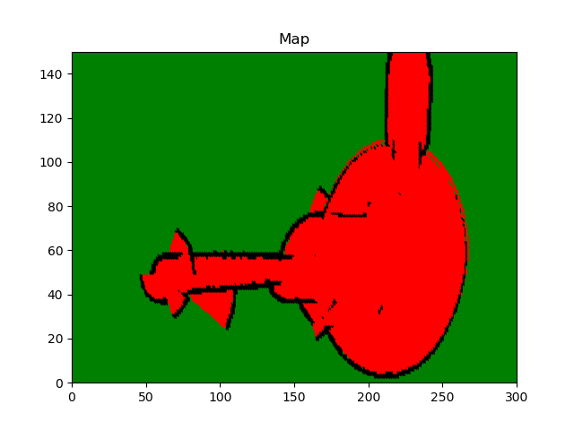

# RoboND-OccupancyGridMappingAlgorithm
You will visualize the mapped environment through the generated image

### Instruction

Step 1:  Occupancy_Grid_Mapping

Step_2: Inverse_Sensor_Model

Step 3: Go to RoboND-OccupancyGridMappingAlgorithm to see the original repo and instructions.
### Compiling
```sh
$ cd RoboND-OccupancyGridMappingAlgorithm/
$ rm -rf Images/* #Delete the folder content and not the folder itself!
$ g++ solution.cpp -o app -std=c++11 -I/usr/include/python2.7 -lpython2.7
```

### Running
```sh
$ ./app
```

Now, wait for the program to generate the map!

### Generated Map



